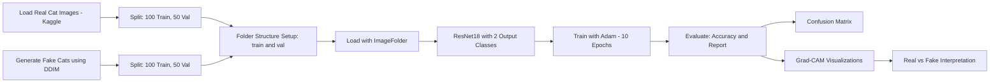

# 🧠 Transfer Learning & Diffusion-Based Classification

## Part 1: Ants vs Bees - Transfer Learning

### 🔍 Approach
I approached transfer learning by leveraging a pretrained ResNet-18 model from torchvision. Two setups were implemented:

- **Fine-tuning all layers**
- **Fixed feature extractor** (only FC layer trained)

Data augmentation was applied to boost generalization.

### 🛠️ Implementation
- Dataset: [Hymenoptera Dataset](https://download.pytorch.org/tutorial/hymenoptera_data.zip)
- Preprocessing: Resize, Normalize, RandomHorizontalFlip
- Training Details:
  - Loss: CrossEntropyLoss
  - Optimizer: SGD (momentum=0.9)
  - LR Scheduler: StepLR
  - Models: ResNet-18 (fully fine-tuned & frozen feature extractor)

Code Blocks:
- `# PART 1: Dataset and Model Setup`
- `# PART 1: Training Function`
- `# PART 1: Finetune All Layers`
- `# PART 1: Feature Extractor Mode`
- `# PART 1: Evaluation`

Training was done on an **NVIDIA A100 GPU**.

```mermaid
flowchart LR
    A[Start: Load Hymenoptera Dataset] --> B[Preprocess: Resize, Normalize, Augment]
    B --> C[Split into Train / Val]
    C --> D{Transfer Learning Mode?}
    D -->|Fine-tune All Layers| E1[ResNet-18 → Replace FC]
    D -->|Feature Extractor| E2[Freeze All Except FC]
    E1 --> F[Train Model - SGD, LR Scheduler]
    E2 --> F
    F --> G[Evaluate on Val Set]
    G --> H[Classification Report]
    G --> I[Confusion Matrix]
    G --> J[Grad-CAM Visualization]
    J --> K[Compare Results]
```

### 📊 Results
#### Fine-tuned ResNet-18
- Best Val Accuracy: **94.12%**
- Train Accuracy: **100%**, Train Loss: **0.0402**

#### Classification Report : 

| Class | Precision | Recall | F1 | Support |
|-------|-----------|--------|----|---------|
| ants  | 0.92      | 0.96   | 0.94 | 70 |
| bees  | 0.94      | 0.96   | 0.95 | 83 |
| accuracy  |     |    | 0.94 | 153 |
| macro avg  | 0.94      | 0.94   | 0.94 | 153 |
| weighted avg  | 0.94      | 0.94   | 0.94 | 153 |

#### Confusion Matrix

#### Grad-CAM
Grad-CAM was used to visualize class-discriminative regions. Example visualizations:

| Original Image | Grad-CAM Overlay |
|----------------|------------------|
|  |  | 
|  |  |

#### Feature Extractor ResNet-18
- Best Val Accuracy: **91.50%**
- Train Accuracy: **93.03%**, Train Loss: **0.2079**

#### Classification Report : 

| Class | Precision | Recall | F1 | Support |
|-------|-----------|--------|----|---------|
| ants  | 0.86      | 0.97   | 0.91 | 70 |
| bees  | 0.97      | 0.87   | 0.92 | 83 |
| accuracy  |     |    | 0.92 | 153 |
| macro avg  | 0.92      | 0.92   | 0.91 | 153 |
| weighted avg  | 0.92      | 0.92   | 0.92 | 153 |

#### Confusion Matrix

#### Grad-CAM
Grad-CAM was used to visualize class-discriminative regions. Example visualizations:

| Image Type | Original Image | Grad-CAM Overlay |
|----------------|----------------|------------------|
| Ant |  |  | 
| Bee |  |  |

## Part 2: Real vs Fake Cats - Diffusion Classification

### 🔍 Approach
- Real Images: 100 from [Kaggle Cat Dataset](https://www.kaggle.com/datasets/crawford/cat-dataset), CAT_01 folder
- Fake Images: 150 from `google/ddpm-cat-256` diffusion model via HuggingFace
- Split: 100 fake (train), 50 fake (val)
- Task: Binary classification (real vs fake)

### 🛠️ Implementation
- Framework: PyTorch + torchvision + diffusers
- Loader: `ImageFolder` with folder structure: `train/real`, `train/fake`, `val/real`, `val/fake`
- Classifier: ResNet-18 with binary FC layer
- Optimizer: Adam
- Epochs: 10

Code Blocks:
- `# PART 2: Diffusion Sampling`
- `# PART 2: Dataset Setup`
- `# PART 2: Fake-vs-Real Classifier`
- `# PART 2: Evaluation Report`

### 📊 Results
- Best Val Accuracy: **95.0%**
- Train Loss: **0.0054**

#### Classification Report
| Class | Precision | Recall | F1 | Support |
|-------|-----------|--------|----|---------|
| Real  | 0.96      | 0.94   | 0.95 | 50 |
| Fake  | 0.94      | 0.96   | 0.95 | 50 |
| accuracy  |     |    | 0.95 | 100 |
| macro avg  | 0.95      | 0.95   | 0.95 | 100 |
| weighted avg  | 0.95      | 0.95   | 0.95 | 100 |

#### Confusion Matrix

### 📌 Grad-CAM
Grad-CAM helped visualize how the model distinguished real vs fake.

| Image Type | Original Image | Grad-CAM Overlay |
|----------------|----------------|------------------|
| Fake |  |  | 
| Real |  |  | 

## 💡 Discussion & Conclusion
- Transfer learning achieves strong performance even on small datasets.
- Fine-tuning outperforms frozen features but requires more compute.
- DDIM-generated cat images were surprisingly realistic.
- Grad-CAM offers insights into model behavior and decision boundaries.

### ✅ Reproducibility
- Python 3.10
- Libraries: PyTorch, torchvision, diffusers, scikit-learn
- `requirements.txt` provided for setup

---

**Author:** Aryan Jain

**Course:** CS 614 Assignment – Transfer Learning & Synthetic Image Classification

---
